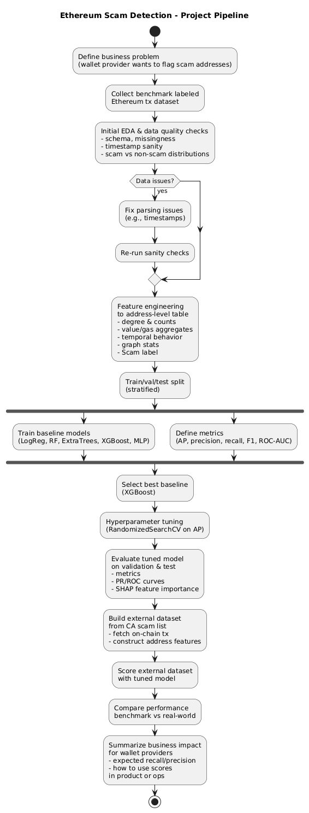

# Machine Learning Modeling and Pipeline: Synthentic Data for Modeling Fraud in Ethereum Transactions

----

### BLUF — How the project changed and what we learned

Compared to the original pitch, the project shifted from a broad “model zoo + possible SGAN + synthetic augmentation” idea to a **deployment-oriented fraud scoring pipeline** focused on **time, drift, and external validation**:

- **Scope vs original pitch**
  - Originally: supervised models on a labeled Ethereum benchmark (LogReg, RF, ExtraTrees, XGBoost, MLP), plus a **stretch goal** of ATD-SGAN / synthetic minority generation, and a **secondary DFPI (California Department of Financial Protection and InnovationPI) dataset** for external evaluation.
  - Finally: kept the **supervised address-level pipeline** and **DFPI external dataset**, but **dropped SGAN and synthetic data** as out of scope.  
    The project energy went into:
    - Building a **clean, reusable feature-engineering + modeling pipeline**.
    - Comparing **random vs time-based splits**.
    - Testing **generalization to California DFPI scam wallets**.

- **Key model results (top-line numbers)**
  - **Random address split (same distribution, tuned XGBoost)**  
    - ROC AUC ≈ **0.998**, AP ≈ **0.79**  
    - At a precision-first operating point (precision ≥ 0.75 on validation):  
      - Precision ≈ **0.79**, Recall ≈ **0.68**, F1 ≈ **0.73**  
      - A **small high-risk segment** where ~**80% of alerts are true scams**.
  - **Time-based split (train on past, test on future, tuned XGBoost)**  
    - Future-window band: AUC ≈ **0.90–0.91**, AP ≈ **0.49–0.54**  
    - At the same precision-first rule:  
      - Precision ≈ **0.91**, Recall ≈ **0.25**, F1 ≈ **0.39**  
      - Very **clean alerts** (91% of flagged addresses are scams) but the model **misses ~3 out of 4 scams** as patterns drift.
  - **DFPI external evaluation (no retraining, same features + tuned XGBoost)**  
    - ROC AUC ≈ **0.97**, AP ≈ **0.90** on the **California DFPI scam-wallet dataset**.  
    - Most DFPI-listed scams appear near the **top of the ranked list**, with few benign addresses mixed in.

- **Updated interpretation vs original goal**
  - The original goal was “use ML (and possibly SGAN) to learn scam behavior and flag risky addresses.”  
  - The final project shows **where that works and where it breaks**:
    - On i.i.d. historical data, **behavioral features are extremely powerful** and support a very high-yield alert queue.
    - Under **realistic time drift**, performance naturally drops: the model stays precise but loses recall, so **drift monitoring and retraining become mandatory**, not optional.
    - External DFPI results show the model is **learning transferable fraud signals**, not just memorizing the benchmark.

- **How this empowers a wallet provider**
  - Provides a **concrete behavioral scoring pipeline** (features + tuned XGBoost) that can:
    - Feed a **warning banner** before send.
    - Drive a **short, prioritized queue** for fraud investigators.
    - Maintain an **internal adaptive scam list** that can be refreshed as new labels arrive.
  - Gives **actionable guidance on governance**, not just a ROC curve:
    - Use **time-aware splits** instead of flattering random splits when estimating production performance.
    - Treat random-split metrics as an **upper bound**, time-split metrics as a **realistic envelope**.
    - Pair the model with **periodic retraining + drift checks** and external lists (DFPI-style) to keep coverage of new scams.

Net: the project moved from “can we model scams (maybe with SGAN)?” to “here is a realistic, defensible way for a wallet provider to **score addresses, evaluate that score under drift, and keep the system useful over time**.”

----

### 1. Business Problem Scenario

### Business problem

Fraud on public blockchains like Ethereum erodes trust for everyone in the ecosystem.
Today, **wallet providers, exchanges, and blockchain-analytics companies** all try to keep internal “scam lists” of high-risk addresses, but there is no shared master scam list, labels are treated as proprietary and confidential, and simple rule-based systems struggle to keep up with evolving scam patterns.

⠀
For a wallet provider, this means: Users may unknowingly send funds to known scam addresses, providers face reputation and compliance risks for facilitating repeated fraud, and fraud‑operations teams often lose time to manual triage instead of higher‑value investigative work.

⠀
**Business goal:**
The aim is to flag high‑risk destinations before a transaction is sent, help internal risk teams prioritize the most suspicious addresses for review, and allow wallet providers to maintain an adaptive internal scam list without sharing sensitive labels.

⠀
### Why machine learning?
Ethereum produces massive, high‑dimensional, time‑dependent data that cannot be meaningfully reviewed by humans. Scam behavior changes rapidly and includes non‑linear patterns such as timing bursts, unusual gas‑price behavior, and characteristic transaction fan‑outs. Machine learning can capture these behavioral signatures from historical labeled data, retrain as scams evolve, and score new addresses in near real time.

⠀
### Dataset description and relevance

The core training data is the **“Labeled transactions-based dataset on the Ethereum network”** from an academic benchmark repository. The dataset comes from a publicly released benchmark of real Ethereum transactions, organized at the transaction level with roughly 70k labeled examples.

Dataset repository: https://github.com/salam-ammari/Labeled-Transactions-based-Dataset-of-Ethereum-Network

Each row contains the core transactional fields—hash, nonce, addresses, value, gas attributes, input data, timestamps, block metadata, and scam‑related fields such as from_scam, to_scam, from_category, and to_category.

⠀
From this transaction-level data, I construct an **address-level feature table** that summarizes behavior of each wallet over time (counts, amounts, timing, gas usage, etc.). The target label **Scam** is 1 if an address ever appears as a labeled scam in the source data.

To test whether models trained on this benchmark transfer to real-world signals, I will also build a **secondary evaluation dataset** by:
* Pulling **known scam addresses** from a public regulator (e.g., State of California’s published list of fraudulent crypto wallets).
* Fetching their on-chain transactions and mixing them with background traffic.
* Scoring these addresses with the trained model as an **external hold-out test set**.

⠀
This two‑dataset design allows me to evaluate models under controlled conditions while also testing whether the learned patterns transfer to real regulatory data.

⠀
### Success criteria

**Technical success (model-level):**
Technical success is measured primarily by Average Precision (AP), which summarizes performance across all classification thresholds and is well‑suited for heavily imbalanced fraud problems. Secondary measures such as precision, recall, F1, ROC‑AUC, and confusion‑matrix behavior help validate robustness and guide operational threshold selection.

⠀
**Business success (stakeholder-level):**

In practice, a wallet provider succeeds when the model achieves high recall on scam addresses at a tolerable false‑positive rate, flags a meaningful share of scam‑related transaction volume before it is sent, reduces investigator workload through better prioritization, and enables an internally maintained, continuously updated scam list.

⠀
⸻

### 2. Problem-Solving Process

### Data acquisition and understanding
* **Acquisition**
  * Download benchmark **labeled Ethereum transaction dataset** from its public GitHub / paper repository.
  * Fetch reference scam addresses from the California DFPI Crypto Scam Tracker: https://dfpi.ca.gov/consumers/crypto/crypto-scam-tracker/
  * Build a **second, real-world evaluation dataset** by:
    * Pulling scam addresses from California’s public scam-wallet list.
    * Fetching on-chain transactions for those addresses plus background traffic.
* **Initial data quality checks & EDA**
	* Inspect schema, types, and missingness.
	* Run **timestamp normalization and sanity checks** (this already caught a major format leak between scam and non-scam records, which I’ll explicitly avoid in the final pipeline).
	* Explore:
		* Transaction timestamp distribution and coverage.
		* Inter-transaction gap distributions.
		* Gas, gas-price, and value distributions (log histograms, hexbin).
		* Address-level activity (Zipf plots, degree CDFs).
		* Scam vs non-scam differences in value, gas, and volume.
* **Preliminary visualization strategy**
  * Time-series plots (daily volume).
  * Histograms and CDFs for gaps, value, gas, and degrees.
  * Comparison plots for **scam vs non-scam** behavior.

⠀
### Data preparation and feature engineering

Data cleaning and feature engineering are already prototyped in the notebook; the production version will:
1. **Robust timestamp parsing**
   * Normalize multiple timestamp string formats to UTC.
   * Convert to a numeric **seconds-since-dataset-start** field.
   * Explicitly verify that **timestamp formats themselves do not encode the label** (i.e., avoid the earlier bug where scam rows used a unique format).
2. **Numeric cleaning (zero-loss)**
   * Coerce numeric string columns (value, gas, gas_price, etc.) to numeric, fill invalids with 0, retain all rows.
3. **Aggregate to address-level feature table** For each address (sender or receiver), compute:
	* **Degree / connectivity**
		* in_degree, out_degree, all_degree
		* unique in_degree, unique out_degree
	* **Amount behavior**
		* Incoming: mean, sum, max, min.
		* Outgoing: mean, sum, max, min.
	* **Temporal behavior**
		* Avg time incoming, Avg time outgoing
		* Active Duration, Total transaction time
		* Mean / Max / Min time interval between transactions
		* Burstiness = max_gap / median_gap
		* Tx count, Activity Density (tx per unit active time)
		* Incoming count, Outgoing count, In/Out Ratio
		* Hour mean and Hour entropy (time of day and spread)
		* Last seen and Recency
	* **Gas behavior**
		* Avg gas price, Avg gas limit
	* **Graph structure**
		* Undirected graph clustering coefficient (NetworkX).
4. **Label construction**
   * Define **Scam = 1** if an address ever appears as a scam in any of:
     * from_scam, to_scam
     * from_category, to_category containing scam-words (scam, fraud, phish, etc.).
   * All other addresses: Scam = 0.
5. **Export**
   * Save engineered feature table as CSV/Parquet for modeling.
6. **scikit-learn pipeline**⠀Conceptually:
	* **Preprocessing:**
		* Train/val/test split with **stratification** (≈70/15/15).
		* **StandardScaler** for models that need scaling (logistic regression, MLP).
	* **Modeling:**
		* Fit multiple algorithms from the same feature table.
	* **Evaluation:**
		* Compute metrics and plots via shared utilities (ROC, PR, threshold sweeps, calibration, confusion matrix).

⠀In the final project I can wrap this into a Pipeline / function set so the same steps are reusable when scoring the external California-based dataset.

### Modeling strategy

**Algorithms to evaluate (≥3):**

From the notebook, I already have:
* **Logistic Regression** (with class_weight="balanced").
* **Random Forest**.
* **ExtraTrees**.
* **XGBoost**.
* **MLPClassifier** (shallow neural net).

Additionally, as a stretch experiment, I will explore the SGAN-based semi-supervised approach described in “ATD-SGAN: Address Transaction Distribution–Semi-Supervised Generative Adversarial Network for Fraud Detection in Ethereum” (IEEE, 2023). This method augments the dataset by generating synthetic minority-class samples aligned with the statistical structure of known fraudulent addresses. If time allows, I will reproduce a simplified version of this approach and document its impact on model calibration and precision–recall behavior.

⠀
I will treat:
* Logistic Regression as a **simple linear baseline**.
* RandomForest and ExtraTrees as **non-linear tree ensembles**.
* **XGBoost** as the main model, since it already shows the best precision–recall performance.
* MLP as exploratory / likely to be dropped if it doesn’t outperform the trees.

⠀
**Cross-validation strategy**
* Use a **train/val/test split** (≈70/15/15) with stratification.
* For hyperparameter tuning:
  * Use **RandomizedSearchCV with 3-fold CV**, scoring on **Average Precision** to directly optimize ranking of scams.

⠀
**Hyperparameter tuning**
* Stage 1: broad RandomizedSearch on XGBoost, RF, and ExtraTrees to identify promising regions.
* Stage 2: **narrowed RandomizedSearch around the best XGBoost baseline**, focusing on:
  * max_depth, learning_rate, n_estimators
  * subsample, colsample_bytree
  * gamma, reg_alpha, reg_lambda, min_child_weight
* Use scale_pos_weight in XGBoost and class_weight="balanced" in tree / linear models to address class imbalance.

⠀
**Evaluation metrics**
* Primary: **Average Precision (AP)** on validation and test splits.
* Secondary:
  * Precision, recall, F1 at a fixed threshold (starting at 0.5, later potentially optimized).
  * ROC-AUC, confusion matrix, calibration curves.
* For the **California external dataset**, report:
  * AP, precision, recall at an operational threshold chosen to keep false-positive rate manageable.

⠀
### Results interpretation and communication
* Use **feature importance and SHAP**:
  Feature‑importance and SHAP analyses highlight patterns such as unusual time‑of‑day behavior, characteristic incoming transaction structures, dense bursts of activity, gas‑usage anomalies, and recency effects that distinguish scam addresses from normal accounts.
* Translate to business terms:
  * “Scam addresses tend to transact in short, concentrated bursts at unusual hours, with characteristic incoming deposits and gas patterns.”
  * Provide examples of **top-ranked scam-like addresses** and how a wallet provider could:
    * Show a **warning banner** before sending.
    * Route them to **manual review**.
* Visualization for stakeholders:
  * PR curves and ROC curves for baseline vs tuned model.
  * Bar plots of top SHAP features.
  * Simple confusion-matrix-style breakdown: “Of N known scams, the model flagged K” at a specific threshold.
  * If time allows, a **mock UI screenshot** showing how a model score could appear in a wallet product.

⠀
### Conceptual framework (PUML flowchart)

### 3. Timeline and Scope (This Week: Mon–Fri)

Assuming one project week left, here’s a concrete plan mapped to the rubric bullets.

### Monday – Dataset Finalization & Problem Formulation
* Lock **business problem statement** and stakeholders (wallet providers + users).
* Finalize **project repo structure** and documentation skeleton.
* Finish **clean EDA notebook** with corrected timestamp handling.
* Start building **California scam-based dataset**:
  * Scrape / download scam wallets from the CA site.
  * Outline script to fetch their Ethereum transactions.

⠀
### Tuesday – EDA & Data Preprocessing
* Complete **EDA** on both:
  * Benchmark dataset (already mostly done; just clean up and re-run after timestamp fix).
  * Early slice of CA-based data if available.
* Finalize **data cleaning + feature-engineering code** into a reusable module / notebook:
  * Robust timestamp parsing.
  * Numeric coercion.
  * Address-level feature table build.
* Generate and save **address_features.csv/parquet** as the canonical modeling dataset.

⠀
### Wednesday – Model Development
* Implement **baseline models** (LogReg, RF, ExtraTrees, XGBoost, MLP) on the engineered features.
* Run **train/val/test split + scaling** as in the current notebook.
* Capture comparison table across models (AP, precision, recall, F1).
* Decide which models move forward (likely **XGBoost + one tree ensemble as backup**).

⠀
### Thursday – Model Evaluation & Refinement
* Run **narrow RandomizedSearchCV** on XGBoost (and optionally RF/ET) using AP as the scoring metric.
* Evaluate tuned models on **validation + test** sets.
* Generate **evaluation plots** for the final chosen model:
  * ROC, PR, threshold curves, confusion matrix, calibration.
* Run **SHAP analysis** on the tuned XGBoost and export:
  * Beeswarm and bar plots.
  * Ranked feature-importance table.
* If time allows, explore the **semi-supervised SGAN / ATD-SGAN** approach as an experimental extension:
  * Prototype small experiment where synthetic samples are added.
  * Document results qualitatively, even if not fully production-ready.

⠀
### Friday – Documentation, Reporting, Final Review
* **Documentation & reporting**
  * Clean notebooks (EDA, feature engineering, modeling).
  * Write the **technical report** and **executive-level summary** (focused on business problem, method, and key findings).
  * Add diagrams (flowchart, plots, SHAP charts) to the report / slides.
* **External evaluation**
  * Run tuned model on **California scam-wallet dataset** (if fully ready) and summarize performance.
* **Final review & submission**
  * QA: rerun notebooks from top to bottom.
  * Record project video / presentation.
  * Package repo, report, and slides for submission.

⠀
### Anticipated challenges / learning needs
* **Label leakage & data quality**

⠀Ensuring features like timestamp formats don’t accidentally encode the label (as discovered in the initial bug) and that any pre-processing is strictly label-safe.
* **Class imbalance & threshold choice**

⠀Tuning for realistic business thresholds where false positives are tolerable but not overwhelming.
* **Domain shift: synthetic → real**

⠀Evaluating how well patterns learned from the benchmark dataset generalize to the California scam-wallet dataset; may require:
	* Additional feature engineering, or
	* Re-weighting / fine-tuning on a small subset of real data.
* **Advanced models (SGAN / ATD-SGAN)**

⠀Implementing semi-supervised GAN approaches may require extra reading and careful experimentation; I’ll treat this as a **stretch goal**, not core scope, and document any partial progress.

